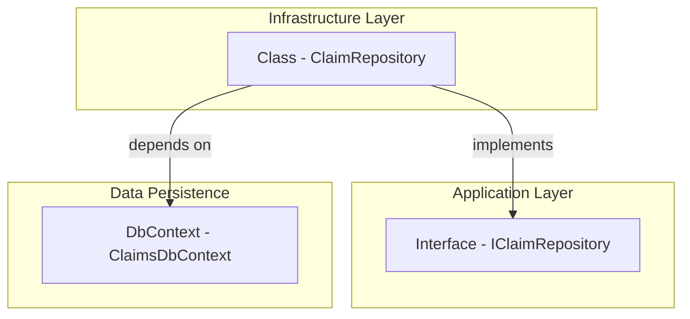

# Claim Repository Interface Feature Documentation

## Overview

The **IClaimRepository** interface defines a contract for managing `Claim` entities within the Claims service. It abstracts data access operations—such as retrieval, creation, and updates—from the underlying persistence mechanism. By depending on this interface, business logic remains decoupled from infrastructure concerns, enabling flexibility and testability.

This interface fits into the **Application Layer** of the Claims bounded context. Implementations of this interface (e.g., `ClaimRepository`) reside in the Infrastructure layer and interact with the `ClaimsDbContext` to perform Entity Framework Core operations.

## Architecture Overview



## Component Structure

### Data Access Abstraction

#### **IClaimRepository** ()

- **Purpose:**

Defines CRUD-style operations for `Claim` domain entities without exposing persistence details.

- **Key Methods:**

| Method Signature | Description | Returns |
| --- | --- | --- |
| `Task<Claim?> GetByIdAsync(Guid id, CancellationToken cancellationToken = default)` | Retrieves a single `Claim` by its unique identifier. | `Task<Claim?>` |
| `Task<IEnumerable<Claim>> GetByMemberIdAsync(Guid memberId, CancellationToken cancellationToken = default)` | Retrieves all `Claim` instances for a given member. | `Task<IEnumerable<Claim>>` |
| `Task AddAsync(Claim claim, CancellationToken cancellationToken = default)` | Adds a new `Claim` to persistence. | `Task` |
| `Task UpdateAsync(Claim claim, CancellationToken cancellationToken = default)` | Updates an existing `Claim`. | `Task` |


## Implementation

```card
{
    "title": "Implementation Link",
    "content": "The `ClaimRepository` class in the Infrastructure layer implements `IClaimRepository` using EF Core and `ClaimsDbContext`.",
    "type": "",
    "filePath": "",
    "badges": []
}
```

Claim refers to the domain entity defined in MedClaim.Claims.Domain.Entities.

- **Implementing Class:**

`MedClaim.Claims.Infrastructure.Persistence.Repositories.ClaimRepository`

## Dependencies

- **Domain Entity:**- `MedClaim.Claims.Domain.Entities.Claim`

- **.NET Types:**- `System.Guid`
- `System.Threading.CancellationToken`
- `System.Threading.Tasks.Task`
- `System.Collections.Generic.IEnumerable<T>`

## Key Classes Reference

| Class | Location | Responsibility |
| --- | --- | --- |
| `IClaimRepository` |  | Defines data operations for `Claim` entities in the Application layer. |
| `ClaimRepository` |  | Concrete EF Core–backed implementation of `IClaimRepository`. |
| `ClaimsDbContext` |  | EF Core `DbContext` for Claims service. |


## Integration Points

- **Application Layer:**- Command handlers (e.g., `SubmitClaimCommandHandler`) rely on `IClaimRepository` to persist new claims.
- Query handlers use `GetByIdAsync` and `GetByMemberIdAsync` to fetch claim data.

- **Infrastructure Layer:**- `ClaimRepository` injects `ClaimsDbContext` via constructor for EF Core operations.

## Error Handling

Implementations should propagate exceptions from EF Core (e.g., `DbUpdateException`) to calling services or wrap them in application-specific exceptions. The interface itself does not prescribe error handling behavior.

## Caching Strategy

No caching behavior is defined at this abstraction level. Caching concerns, if any, must be handled by higher-level services or decorators wrapping `IClaimRepository`.

## Testing Considerations

- **Unit Tests:**- Mock `IClaimRepository` to simulate data scenarios for command/query handlers.
- **Integration Tests:**- Verify that `ClaimRepository` correctly interacts with an in-memory or test SQLite database via `ClaimsDbContext`.