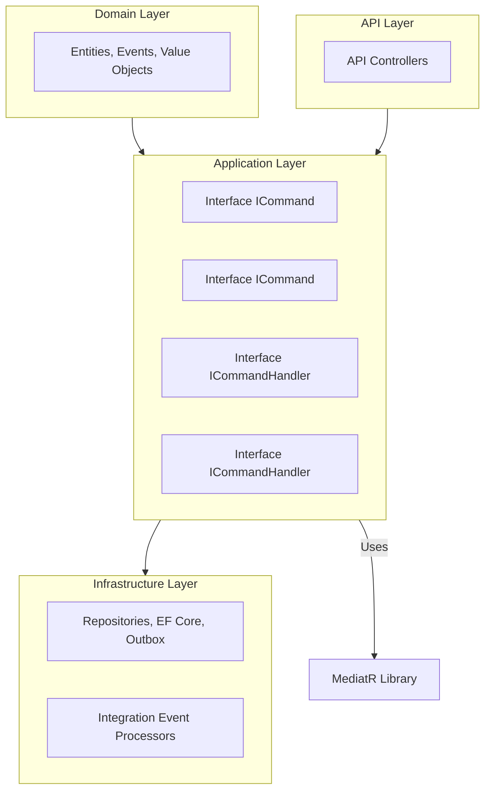
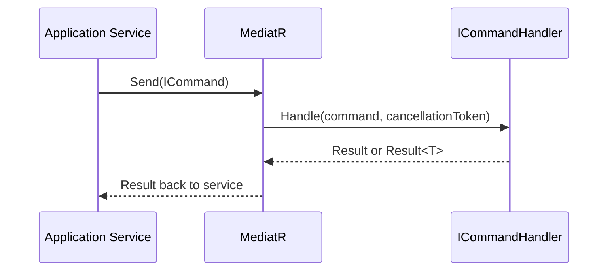

# Command Handler Abstractions Feature Documentation

## Overview

> [!IMPORTANT]  
> This file defines core abstractions for **command messages** and their **handlers** in the Claims Application using the CQRS pattern with MediatR.

The **Command Handler Abstractions** provide a uniform way to represent operations that change state (commands) and their corresponding processing logic (handlers). By wrapping commands in a `Result` or `Result<T>`, they enforce consistent success/failure reporting across the application. These interfaces live in the **Application Layer** of the Claims service and decouple command definitions from implementation details.

This abstraction simplifies:
- **Error handling** via the `Result` primitive  
- **Dependency injection** of handlers through MediatR  
- **Scalability** by allowing easy addition of new commands and handlers

## Architecture Overview



## Component Structure 🧩

### Command Interfaces

| Interface                             | Generics    | Extends                          | Description                                                             |
|---------------------------------------|-------------|----------------------------------|-------------------------------------------------------------------------|
| **ICommand** [badge:public]           | —           | `IRequest<Result>`               | Marker for commands without a return value.                             |
| **ICommand<TResponse>** [badge:public]| `TResponse` | `IRequest<Result<TResponse>>`    | Marker for commands that return a typed result.                         |

### Command Handler Interfaces

| Interface                                          | Generics              | Extends                                           | Description                                                                                             |
|----------------------------------------------------|-----------------------|---------------------------------------------------|---------------------------------------------------------------------------------------------------------|
| **ICommandHandler<TCommand>** [badge:public]       | `TCommand`            | `IRequestHandler<TCommand, Result>`               | Handles commands without a return value. <br/>`TCommand` must implement `ICommand`.                      |
| **ICommandHandler<TCommand, TResponse>** [badge:public] | `TCommand, TResponse` | `IRequestHandler<TCommand, Result<TResponse>>`    | Handles commands that return `TResponse`. <br/>`TCommand` must implement `ICommand<TResponse>`.          |

```csharp
using MedClaim.Shared.Primitives;
using MediatR;

namespace MedClaim.Claims.Application.Abstractions;

public interface ICommand : IRequest<Result> { }

public interface ICommand<TResponse> : IRequest<Result<TResponse>> { }

public interface ICommandHandler<TCommand> : IRequestHandler<TCommand, Result>
    where TCommand : ICommand { }

public interface ICommandHandler<TCommand, TResponse> : IRequestHandler<TCommand, Result<TResponse>>
    where TCommand : ICommand<TResponse> { }
```

## Dependencies ⚙️

- **MediatR**: Provides the `IRequest` and `IRequestHandler` primitives.  
- **MedClaim.Shared.Primitives**: Supplies the `Result` and `Result<T>` types for standardized outcome handling.

## Integration Points

- **Domain Layer**: Defines concrete `record` types for commands (e.g., `SubmitClaimCommand : ICommand<Guid>`).  
- **Infrastructure Layer**: Registers all `ICommandHandler<…, …>` implementations with the DI container and MediatR.  
- **API Layer**: Dispatches commands using `IMediator.Send(...)`, leveraging these abstractions for consistency.

## Feature Flows

### Command Dispatch Flow



1. The **API** or **Service** layer constructs an `ICommand` or `ICommand<TResponse>`.  
2. It calls `mediator.Send(command)`.  
3. MediatR locates the matching `ICommandHandler<…>` implementation.  
4. The handler executes business logic and returns a `Result`.  
5. The outcome propagates back to the caller for further processing or HTTP response.

## Key Classes Reference

| Interface                                  | Location                                                                    | Responsibility                                                    |
|--------------------------------------------|-----------------------------------------------------------------------------|-------------------------------------------------------------------|
| `ICommand`                                 | `src/Services/Claims/.../ICommandHandler.cs`                                | Marker for non-returning commands.                                |
| `ICommand<TResponse>`                      | `src/Services/Claims/.../ICommandHandler.cs`                                | Marker for commands with a typed return.                         |
| `ICommandHandler<TCommand>`                | `src/Services/Claims/.../ICommandHandler.cs`                                | Defines handler for `ICommand`.                                   |
| `ICommandHandler<TCommand, TResponse>`     | `src/Services/Claims/.../ICommandHandler.cs`                                | Defines handler for `ICommand<TResponse>`.                       |

## Error Handling

All command handlers return a `Result` or `Result<T>`, which encapsulates:
- **Success** state with optional data  
- **Failure** state with one or more error messages  

This pattern centralizes error handling and avoids exception leakage.

## Testing Considerations

- **Unit Testing**: Mock `ICommandHandler<…>` to verify command dispatch without executing real logic.  
- **Behavioral Tests**: Use in-memory MediatR setup to send commands and assert on returned `Result` objects.  

---

```card
{"title":"CQRS Command Pattern","content":"This file abstracts commands and their handlers using MediatR, ensuring consistent message handling in the Claims service."}
```