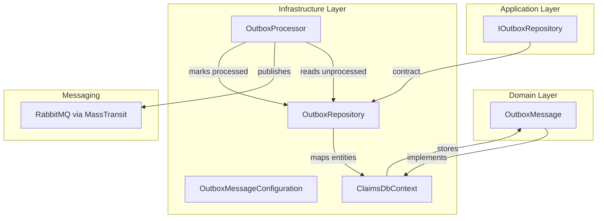
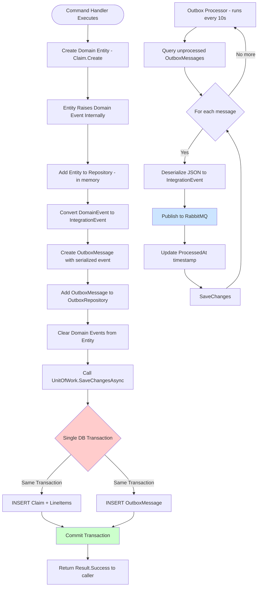

# Outbox Repository Feature Documentation

## Overview

The Outbox Repository feature provides an abstraction and implementation for the **Outbox Pattern** within the Claims service. It allows the application to record integration events alongside domain transactions, ensuring reliable message delivery.  
By persisting events in a database table, this pattern guarantees consistency between database updates and message publication, reducing the risk of data loss or duplicate processing.

In the broader **MedClaim.Claims** application, the `IOutboxRepository` interface standardizes how outbox messages are stored, queried, and acknowledged. The infrastructure layer implements this contract using Entity Framework Core and coordinates with a background processor to publish messages to RabbitMQ.

## Architecture Overview



## Component Structure

### 1. Application Layer

#### **IOutboxRepository** (`src/Services/Claims/MedClaim.Claims.Application/Abstractions/IOutboxRepository.cs`)

- **Purpose**  
  Defines the contract for storing and retrieving outbox messages used for integration events.  
- **Key Methods**  

| Method                              | Description                                             | Returns                                    |
|-------------------------------------|---------------------------------------------------------|--------------------------------------------|
| `AddAsync(OutboxMessage, ...)`      | Enqueue a new outbox message within the current UoW.    | `Task`                                     |
| `GetUnprocessedAsync(...)`          | Fetch unprocessed messages (max 20, retry < 5), ordered by creation time. | `Task<IEnumerable<OutboxMessage>>`         |
| `MarkAsProcessedAsync(Guid, ...)`   | Flag a message as processed by setting its timestamp.   | `Task`                                     |


### 2. Domain Layer

#### **OutboxMessage** (`src/Services/Claims/MedClaim.Claims.Domain/Entities/OutboxMessage.cs`)

- **Purpose**  
  Represents a serialized integration event awaiting publication.  
- **Key Properties**  

| Property      | Type       | Description                                                       |
|---------------|------------|-------------------------------------------------------------------|
| `Id`          | `Guid`     | Unique identifier for the message.                                |
| `EventType`   | `string`   | CLR type name of the integration event.                           |
| `Payload`     | `string`   | JSON-serialized event data.                                       |
| `CreatedAt`   | `DateTime` | UTC timestamp when the message was created.                       |
| `ProcessedAt` | `DateTime?`| UTC timestamp when the message was successfully published.        |
| `RetryCount`  | `int`      | Number of failed publication attempts.                            |

- **Key Methods**  

| Method                        | Description                                                   |
|-------------------------------|---------------------------------------------------------------|
| `static Create(string,string)` | Factory constructor; sets `Id`, `EventType`, `Payload`, `CreatedAt`. |
| `MarkAsProcessed()`           | Sets `ProcessedAt` to the current UTC time.                   |
| `IncrementRetry()`            | Increments the internal `RetryCount`.                         |


### 3. Infrastructure Layer

#### **OutboxRepository** (`src/Services/Claims/MedClaim.Claims.Infrastructure/Persistence/Repositories/OutboxRepository.cs`)

- **Purpose**  
  Implements `IOutboxRepository` using EF Core against the `OutboxMessages` table.  
- **Implementation Details**  
  - **AddAsync**: Calls `_context.OutboxMessages.AddAsync(...)`.  
  - **GetUnprocessedAsync**: Queries for `ProcessedAt == null && RetryCount < 5`, orders by `CreatedAt`, takes 20.  
  - **MarkAsProcessedAsync**: Loads by `Id` and invokes `MarkAsProcessed()`.  

```csharp
public async Task<IEnumerable<OutboxMessage>> GetUnprocessedAsync(CancellationToken ct)
{
    return await _context.OutboxMessages
        .Where(o => o.ProcessedAt == null && o.RetryCount < 5)
        .OrderBy(o => o.CreatedAt)
        .Take(20)
        .ToListAsync(ct);
}
```


#### **OutboxMessageConfiguration** (`src/Services/Claims/MedClaim.Claims.Infrastructure/Persistence/Configurations/OutboxMessageConfiguration.cs`)

- **Purpose**  
  Fluent API mapping for the `OutboxMessage` entity.  
- **Highlights**  
  - Maps to table **OutboxMessages**.  
  - Configures `EventType` (max 200 chars, required), `Payload` (required), `CreatedAt` (required).  
  - Sets default `RetryCount` = 0.  
  - Adds an index on `ProcessedAt` to optimize unprocessed queries.

```csharp
builder.HasIndex(o => o.ProcessedAt);
```


#### **OutboxProcessor** (`src/Services/Claims/MedClaim.Claims.Infrastructure/Messaging/OutboxProcessor.cs`)

- **Purpose**  
  A hosted background service that periodically publishes outbox messages to RabbitMQ via MassTransit.  
- **Flow**  
  1. Every 10 seconds, retrieve up to 20 unprocessed messages.  
  2. Deserialize each `Payload` into its corresponding integration event.  
  3. Publish via `_publishEndpoint.Publish(...)`.  
  4. On success, call `MarkAsProcessedAsync`; on failure, call `IncrementRetry()`.  
  5. Persist state via `unitOfWork.SaveChangesAsync()`.  

```csharp
while (!stoppingToken.IsCancellationRequested)
{
    await ProcessOutboxMessagesAsync(stoppingToken);
    await Task.Delay(_interval, stoppingToken);
}
```


## Feature Flows

### 1. Outbox Pattern Flow

<details>
<summary>View the full outbox pattern sequence</summary>



</details>

## Integration Points

- **Command Handlers**  
  Invoke `IOutboxRepository.AddAsync(...)` to persist integration events.  
- **ClaimsDbContext**  
  Automatically converts domain events into outbox messages in `SaveChangesAsync`.  
- **Unit of Work**  
  Ensures atomicity across claim insertions and outbox messages.  
- **RabbitMQ via MassTransit**  
  Consumes published integration events by downstream services.

## Key Classes Reference

| Class                      | Location                                                              | Responsibility                                       |
|----------------------------|-----------------------------------------------------------------------|------------------------------------------------------|
| `IOutboxRepository`        | `.../Application/Abstractions/IOutboxRepository.cs`                   | Defines outbox persistence operations.               |
| `OutboxMessage`            | `.../Domain/Entities/OutboxMessage.cs`                                | Domain entity representing an integration event.     |
| `OutboxRepository`         | `.../Infrastructure/Persistence/Repositories/OutboxRepository.cs`     | EF Core implementation of the outbox contract.       |
| `OutboxMessageConfiguration`| `.../Infrastructure/Persistence/Configurations/OutboxMessageConfiguration.cs` | EF mapping for `OutboxMessage`.                |
| `OutboxProcessor`          | `.../Infrastructure/Messaging/OutboxProcessor.cs`                     | Background service that publishes outbox messages.   |

## Dependencies

- **Microsoft.EntityFrameworkCore** & **EF Core Tools**: Database persistence.  
- **MassTransit.RabbitMQ**: Publishing integration events.  
- **Microsoft.Extensions.Hosting**: Background service support.  
- **Microsoft.Extensions.Logging**: Diagnostics and retry logging.

## Testing Considerations

- **Repository Unit Tests**  
  - Verify `AddAsync` enqueues messages.  
  - Validate `GetUnprocessedAsync` filters by `ProcessedAt` and `RetryCount`.  
  - Ensure `MarkAsProcessedAsync` sets `ProcessedAt`.  
- **Processor Integration Tests**  
  - Simulate successful and failed publish scenarios; assert `RetryCount` increment.  
  - Confirm idempotent behavior when re-processing the same message.  
- **End-to-End Scenario**  
  - Submit a claim; assert an outbox entry is created and later removed/marked after processor runs.

>[!TIP]  
> Ensure your test database reflects the `OutboxMessageConfiguration` constraints before running EF migrations.