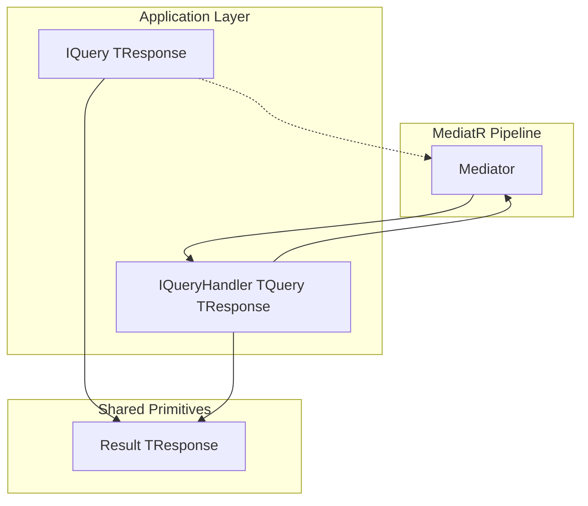
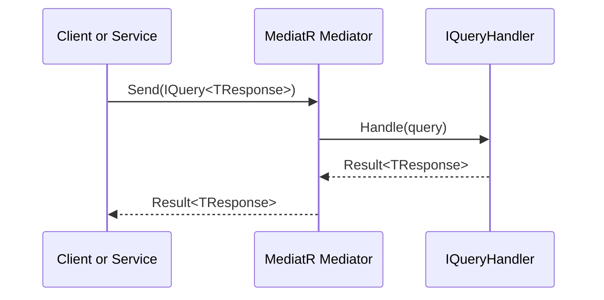

# Query Handler Abstractions Feature Documentation

## Overview

The **Query Handler Abstractions** define a standardized contract for handling read-only operations in the Claims application. They enable a clear separation between query definitions and their execution logic, promoting a consistent CQRS (Command Query Responsibility Segregation) pattern.  
By leveraging MediatR and a unified `Result<T>` wrapper, these interfaces ensure type-safe requests and encapsulated success/failure responses across all query handlers.

> [!NOTE]  
> This abstraction resides in the Application layer of the Claims service, under  
> `src/Services/Claims/MedClaim.Claims.Application/Abstractions/IQueryHandler.cs`.

## Architecture Overview



- **IQuery** defines the request shape.  
- **IQueryHandler** processes queries and returns a `Result<T>`.  
- **Mediator** routes queries to their handlers.  
- **Result<T>** encapsulates success or failure.

## Component Structure

### Application Abstractions

#### 🔍 IQuery<TResponse>  
**Path:** `src/Services/Claims/MedClaim.Claims.Application/Abstractions/IQueryHandler.cs`

- **Purpose:** Marker interface for read-only requests.  
- **Extends:**  
  - `MediatR.IRequest<Result<TResponse>>`  
- **Type Parameters:**  
  - `TResponse` – The shape of the data returned by the query.

```csharp
public interface IQuery<TResponse> : IRequest<Result<TResponse>> { }
```

> [!TIP]  
> Implement `IQuery<T>` in your query DTOs to automatically integrate with MediatR and the shared `Result<T>` type.

#### 🚀 IQueryHandler<TQuery, TResponse>  
**Path:** `src/Services/Claims/MedClaim.Claims.Application/Abstractions/IQueryHandler.cs`

- **Purpose:** Contract for handling queries defined by `IQuery<TResponse>`.  
- **Extends:**  
  - `MediatR.IRequestHandler<TQuery, Result<TResponse>>`  
- **Type Parameters:**  
  - `TQuery` – Must implement `IQuery<TResponse>`.  
  - `TResponse` – The type returned inside `Result<TResponse>`.  

```csharp
public interface IQueryHandler<TQuery, TResponse> 
    : IRequestHandler<TQuery, Result<TResponse>> 
    where TQuery : IQuery<TResponse>
{ }
```

| Interface                         | Type Parameters          | Inherits                                        | Responsibility                                   |
|-----------------------------------|--------------------------|-------------------------------------------------|--------------------------------------------------|
| **IQuery&lt;TResponse&gt;**       | `TResponse`              | IRequest&lt;Result&lt;TResponse&gt;&gt;         | Defines a read request returning `Result<T>`.     |
| **IQueryHandler&lt;TQuery, TResponse&gt;** | `TQuery`, `TResponse` | IRequestHandler&lt;TQuery, Result&lt;TResponse&gt;&gt; | Handles `IQuery<T>` and returns a `Result<T>`. |

## Feature Flows

### Query Processing Sequence



1. **Caller** sends an `IQuery<TResponse>` to the **Mediator**.  
2. **Mediator** locates the registered `IQueryHandler`.  
3. **Handler** executes the query logic and returns `Result<TResponse>`.  
4. **Mediator** relays the result back to the caller.

## Dependencies

- **MediatR**  
  Provides the `IRequest<>` and `IRequestHandler<>` abstractions for in-process messaging.  
- **MedClaim.Shared.Primitives**  
  Contains the `Result<T>` type used to wrap successful responses and errors uniformly.

## Key Interfaces Reference

| Interface                                | Location                                                                          | Role                                              |
|------------------------------------------|-----------------------------------------------------------------------------------|---------------------------------------------------|
| **IQuery&lt;TResponse&gt;**              | `src/Services/Claims/MedClaim.Claims.Application/Abstractions/IQueryHandler.cs`   | Defines a typed, read-only request contract.      |
| **IQueryHandler&lt;TQuery, TResponse&gt;** | `src/Services/Claims/MedClaim.Claims.Application/Abstractions/IQueryHandler.cs`   | Processes `IQuery<T>` instances and returns a `Result<T>`. |

> [!IMPORTANT]  
> All query DTOs must implement `IQuery<T>` and register their handlers as `IQueryHandler<TQuery, TResponse>` in the DI container.