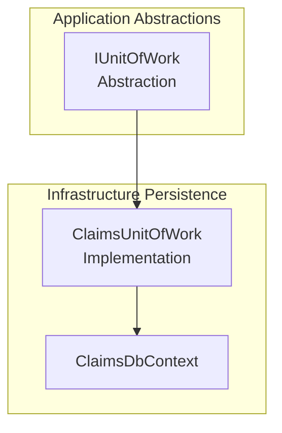

# Unit of Work Feature Documentation

## Overview

The **Unit of Work** pattern in the Claims application coordinates changes across multiple repositories and ensures they are committed as a single atomic transaction. It provides a simple abstraction—**SaveChangesAsync**—to persist all tracked changes in the database. This centralizes transaction management and integrates seamlessly with the outbox pattern for reliable message publishing.

By defining a common contract in the application’s abstractions layer, command and query handlers depend on `IUnitOfWork` rather than a concrete DbContext. The infrastructure implementation then delegates commits to EF Core’s `ClaimsDbContext`. This separation enhances testability and maintains clear layering between business logic and data access.

## Architecture Overview



## Component Structure

### 1. Application Abstractions Layer

#### **IUnitOfWork** (`src/Services/Claims/MedClaim.Claims.Application/Abstractions/IUnitOfWork.cs`)

- **Purpose:** Defines a contract for committing all pending changes to the database in one transaction.
- **Method Table:**

| Method                                                  | Returns   | Description                                                                       |
|---------------------------------------------------------|-----------|-----------------------------------------------------------------------------------|
| SaveChangesAsync(CancellationToken cancellationToken = default) | Task<int> | Persists tracked changes; returns number of state entries written . |

```csharp
namespace MedClaim.Claims.Application.Abstractions;

public interface IUnitOfWork
{
    Task<int> SaveChangesAsync(CancellationToken cancellationToken = default);
}
```

### 2. Infrastructure Persistence Layer

#### **ClaimsUnitOfWork** (`src/Services/Claims/MedClaim.Claims.Infrastructure/Persistence/ClaimsUnitOfWork.cs`)

- **Purpose:** Concrete implementation of `IUnitOfWork` using EF Core’s `DbContext`.
- **Dependencies:**  
  - `ClaimsDbContext` injected via constructor.

```csharp
using MedClaim.Claims.Application.Abstractions;
namespace MedClaim.Claims.Infrastructure.Persistence;

public sealed class ClaimsUnitOfWork : IUnitOfWork
{
    private readonly ClaimsDbContext _context;

    public ClaimsUnitOfWork(ClaimsDbContext context)
    {
        _context = context;
    }

    public async Task<int> SaveChangesAsync(CancellationToken cancellationToken = default)
    {
        return await _context.SaveChangesAsync(cancellationToken);
    }
}
``` 

## Usage in Command Handlers

Command handlers perform domain operations across repositories and then invoke **SaveChangesAsync** exactly once to commit all changes. For instance, in `SubmitClaimCommandHandler`:

```csharp
public async Task<Result<Guid>> Handle(SubmitClaimCommand request, CancellationToken cancellationToken)
{
    // ... build and add claim and outbox messages ...
    await _unitOfWork.SaveChangesAsync(cancellationToken);
    return Result.Success(claim.Id);
}
``` 

> [!NOTE]  
> Leveraging a single `SaveChangesAsync` call ensures that both entity changes and outbox message inserts occur within the same database transaction.

## Key Classes Reference

| Class              | Location                                                                                      | Responsibility                                           |
|--------------------|-----------------------------------------------------------------------------------------------|----------------------------------------------------------|
| **IUnitOfWork**    | src/Services/Claims/MedClaim.Claims.Application/Abstractions/IUnitOfWork.cs                   | Abstraction for committing database transactions.        |
| **ClaimsUnitOfWork** | src/Services/Claims/MedClaim.Claims.Infrastructure/Persistence/ClaimsUnitOfWork.cs           | Implements `IUnitOfWork` via EF Core `ClaimsDbContext`.  |

## Dependencies

- **EF Core** (`ClaimsDbContext`): Underlying DbContext that tracks and persists entity changes.
- **CancellationToken**: Supports graceful cancellation of long-running save operations.

## Testing Considerations

- **Mocking**: `IUnitOfWork` can be mocked to verify that handlers invoke `SaveChangesAsync`.
- **Transactional Behavior**: Simulate failures after repository calls to ensure no partial commits occur.