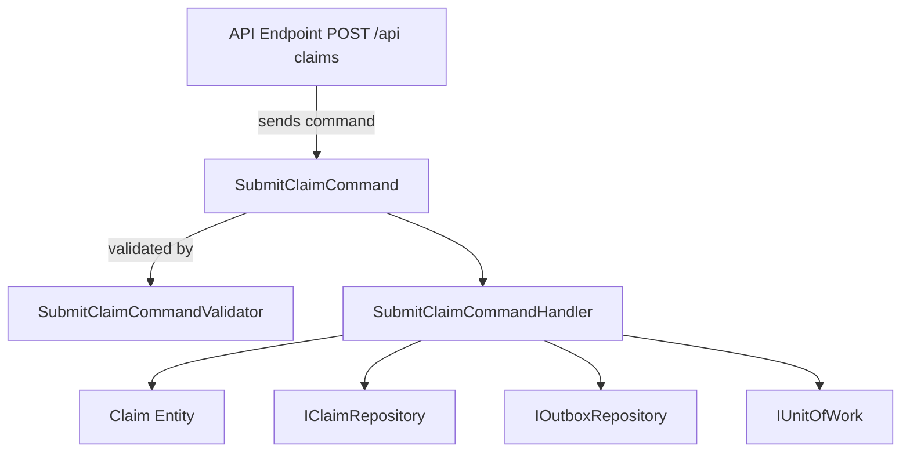

# Submit Claim Feature Documentation

## Overview

The **Submit Claim** feature enables users to submit new insurance claims with multiple service line items. It encapsulates all necessary data—member, policy, notes, and line‐item details—into a single command object. This command travels through the application's business layer, where it is validated, processed, and persisted, ensuring a consistent, transactional workflow and reliable domain‐driven behavior.  

For the business, this provides a structured, audited way to capture claim requests, raise domain events, and integrate with outbound messaging via the outbox pattern.

## Architecture Overview



## Component Structure

### Business Layer

#### **SubmitClaimCommand** (`src/Services/Claims/MedClaim.Claims.Application/Commands/SubmitClaim/SubmitClaimCommand.cs`)

- **Purpose:**  
  Encapsulates all data required to submit a new claim in a single immutable object.  
- **Implements:**  
  `ICommand<Guid>` from `MedClaim.Claims.Application.Abstractions`  
- **Properties:**

| Property  | Type                                        | Description                                   |
|-----------|---------------------------------------------|-----------------------------------------------|
| MemberId  | `Guid`                                      | Identifier of the member submitting the claim |
| PolicyId  | `Guid`                                      | Identifier of the related policy              |
| Notes     | `string`                                    | Freeform notes or comments                    |
| LineItems | `IEnumerable<ClaimLineItemRequest>`         | Collection of service line items              |

```csharp
public sealed record SubmitClaimCommand(
    Guid MemberId,
    Guid PolicyId,
    string Notes,
    IEnumerable<ClaimLineItemRequest> LineItems
) : ICommand<Guid>;
```

#### **ClaimLineItemRequest** (`src/Services/Claims/MedClaim.Claims.Application/Commands/SubmitClaim/SubmitClaimCommand.cs`)

- **Purpose:**  
  Represents a single service line item within a claim submission request.  
- **Properties:**

| Property     | Type      | Description                                |
|--------------|-----------|--------------------------------------------|
| ServiceCode  | `string`  | Code identifying the medical service       |
| ProviderName | `string`  | Name of the service provider               |
| ServiceDate  | `DateTime`| Date when the service was rendered         |
| Amount       | `decimal` | Monetary cost of the service               |

```csharp
public sealed record ClaimLineItemRequest(
    string ServiceCode,
    string ProviderName,
    DateTime ServiceDate,
    decimal Amount
);
```

## Data Models

The `SubmitClaimCommand` and `ClaimLineItemRequest` records together define the request model for claim submission. They are immutable, self‐documenting, and optimized for MediatR dispatch.

## Integration Points

- **SubmitClaimCommandHandler**  
  Consumes `SubmitClaimCommand`, orchestrates domain entity creation, repository persistence, and outbox message creation.

- **SubmitClaimCommandValidator**  
  Validates `SubmitClaimCommand` instances, enforcing required fields and positive amounts before handling.

- **Domain Events & Outbox**  
  Upon creation, the `Claim` entity raises a `ClaimSubmittedEvent`, which the handler converts into a `ClaimSubmittedIntegrationEvent` for the outbox.

## Key Classes Reference

| Class                    | Location                                                                                                 | Responsibility                                            |
|--------------------------|----------------------------------------------------------------------------------------------------------|-----------------------------------------------------------|
| SubmitClaimCommand       | `src/Services/Claims/MedClaim.Claims.Application/Commands/SubmitClaim/SubmitClaimCommand.cs`             | Carries data to submit a new claim                        |
| ClaimLineItemRequest     | `src/Services/Claims/MedClaim.Claims.Application/Commands/SubmitClaim/SubmitClaimCommand.cs`             | Defines a single line item in a claim submission request  |

## Dependencies

- **MedClaim.Claims.Application.Abstractions**  
  Defines the `ICommand<T>` contract used by MediatR.
- **System**  
  Core .NET types (`Guid`, `DateTime`, `IEnumerable<T>`, `decimal`).

## Testing Considerations

- **Validation Scenarios:**  
  - Missing `MemberId` or `PolicyId`  
  - Empty `LineItems` collection  
  - Invalid `Amount` values (≤ 0)  
- **Serialization:**  
  Ensure `ClaimLineItemRequest` serializes correctly if used in integration tests or message payloads.

> [!NOTE]  
> `SubmitClaimCommand` and its DTO are simple, immutable records. Tests can rely on value equality for assertions.