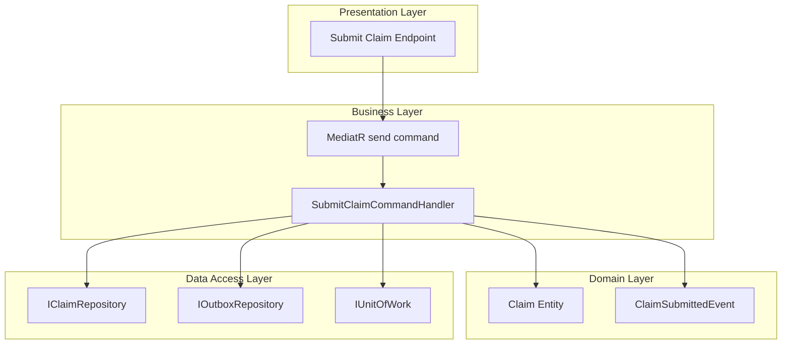
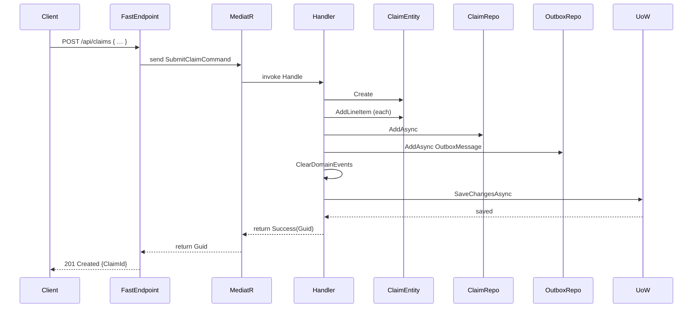

# Submit Claim Feature Documentation 🚀

## Overview

The **Submit Claim** feature allows members to submit healthcare claims with multiple service line items. It captures claim details, validates input, and ensures atomic persistence of both the claim and any integration messages. This process enhances reliability by leveraging a transactional outbox pattern.

In the broader application, this feature sits within the **Claims Application** service. It orchestrates domain logic (creating a claim and raising events), persistence through repositories, and outbox message storage for eventual integration with other services.

## Architecture Overview

## Component Structure

### Business Layer

#### **SubmitClaimCommandHandler**  
*Path:* `src/Services/Claims/MedClaim.Claims.Application/Commands/SubmitClaim/SubmitClaimCommandHandler.cs`

- **Purpose:**  
  Handles the `SubmitClaimCommand` by creating a new claim, attaching line items, converting domain events to integration events, and persisting all changes in a single transaction.

- **Dependencies:**  
  - **IClaimRepository**: Persists `Claim` entities.  
  - **IOutboxRepository**: Stores outbox messages for integration.  
  - **IUnitOfWork**: Commits database transactions atomically.

- **Key Method:**

| Method                                                                                                                   | Description                                                                                                                                                              | Returns                   |
|--------------------------------------------------------------------------------------------------------------------------|--------------------------------------------------------------------------------------------------------------------------------------------------------------------------|---------------------------|
| `Handle(SubmitClaimCommand request, CancellationToken cancellationToken)` [badge:public]                              | 1. Validates presence of line items 2. Creates a `Claim` aggregate 3. Adds each line item to the aggregate 4. Persists claim and outbox messages 5. Commits transaction | `Task<Result<Guid>>`      |

#### **SubmitClaimCommand**  
*Path:* `src/Services/Claims/MedClaim.Claims.Application/Commands/SubmitClaim/SubmitClaimCommand.cs`

- **Purpose:** Encapsulates input data required to submit a claim.

- **Properties:**

| Property    | Type                                | Description                                           |
|-------------|-------------------------------------|-------------------------------------------------------|
| `MemberId`  | `Guid`                              | Identifier of the member submitting the claim.        |
| `PolicyId`  | `Guid`                              | Identifier of the policy under which the claim applies. |
| `Notes`     | `string`                            | Optional remarks or comments related to the claim.    |
| `LineItems` | `IEnumerable<ClaimLineItemRequest>` | Collection of service line items in the claim.        |

#### **ClaimLineItemRequest**

- **Purpose:** Models a single service entry within a claim.

| Property       | Type      | Description                            |
|----------------|-----------|----------------------------------------|
| `ServiceCode`  | `string`  | Code representing the medical service. |
| `ProviderName` | `string`  | Name of the service provider.          |
| `ServiceDate`  | `DateTime`| Date when the service was rendered.    |
| `Amount`       | `decimal` | Charge amount for the service.         |

### Domain Layer

#### **Claim**  
*Path:* `src/Services/Claims/MedClaim.Claims.Domain/Entities/Claim.cs`

- **Factory Method:** `Create(Guid memberId, Guid policyId, string notes)`  
  Instantiates a new claim with status `Submitted` and raises a `ClaimSubmittedEvent`.

- **Key Methods:**
  - `AddLineItem(string serviceCode, string providerName, DateTime serviceDate, decimal amount)`  
    Attaches a `ClaimLineItem` to the aggregate.
  - `UpdateStatus(ClaimStatus newStatus, string changedBy)`  
    Changes claim status and records an audit log.

- **Domain Events:**
  - **ClaimSubmittedEvent** (fired on creation)  
  - **ClaimStatusChangedEvent** (fired on status updates)

#### **ClaimSubmittedEvent**  
*Path:* `src/Services/Claims/MedClaim.Claims.Domain/Events/ClaimSubmittedEvent.cs`

- **Purpose:** Signifies that a new claim was submitted.
- **Properties:**  
  - `ClaimId` (`Guid`)  
  - `MemberId` (`Guid`)  
  - `SubmittedAt` (`DateTime`)

### Integration Events

#### **ClaimSubmittedIntegrationEvent**  
*Path:* `src/Shared/MedClaim.Shared/Contracts/ClaimSubmittedIntegrationEvent.cs`

- **Purpose:** Transports claim submission data to external systems.
- **Properties:**
  - `ClaimId` (`Guid`)  
  - `MemberId` (`Guid`)  
  - `PolicyId` (`Guid`)  
  - `TotalAmount` (`decimal`)  
  - `SubmittedAt` (`DateTime`)

### Data Access Layer

#### **IClaimRepository**

- **Method:** `AddAsync(Claim claim, CancellationToken cancellationToken)`  
  Persists a new claim aggregate.

#### **IOutboxRepository**

- **Method:** `AddAsync(OutboxMessage message, CancellationToken cancellationToken)`  
  Enqueues an integration event for later dispatch.

#### **IUnitOfWork**

- **Method:** `SaveChangesAsync(CancellationToken cancellationToken)`  
  Commits all pending changes—claims, line items, and outbox messages—in one database transaction.

## Feature Flow

### Submit Claim Sequence

## Error Handling

> [!NOTE]  
> The handler returns `Result.Failure<Guid>` if the `LineItems` collection is empty  
> (message: “A claim must have at least one line item”).

Higher-level validation (e.g. required IDs, non-empty fields) is enforced by `SubmitClaimCommandValidator`.

## Dependencies

- **MediatR** for command dispatching  
- **System.Text.Json** for event serialization  
- Domain entities and primitives in `MedClaim.Claims.Domain` and `MedClaim.Shared.Primitives`

## Testing Considerations

- **Empty line items**: expect failure result.  
- **Valid request**: claim persisted, outbox message created, success result returned.  
- **Integration event payload**: validates serialized `ClaimSubmittedIntegrationEvent` matches domain data.

## Key Classes Reference

| Class                          | Location                                                                                 | Responsibility                                         |
|--------------------------------|------------------------------------------------------------------------------------------|--------------------------------------------------------|
| SubmitClaimCommandHandler      | `.../Commands/SubmitClaim/SubmitClaimCommandHandler.cs`                                   | Processes claim submission and outbox enqueuing.       |
| SubmitClaimCommand             | `.../Commands/SubmitClaim/SubmitClaimCommand.cs`                                          | Defines command data for submitting a claim.           |
| ClaimLineItemRequest           | `.../Commands/SubmitClaim/SubmitClaimCommand.cs`                                          | Models a single service entry in the claim.            |
| Claim                           | `.../Domain/Entities/Claim.cs`                                                            | Aggregate root for claim lifecycle.                    |
| ClaimSubmittedEvent            | `.../Domain/Events/ClaimSubmittedEvent.cs`                                                | Domain event fired upon claim creation.                |
| ClaimSubmittedIntegrationEvent | `Shared/MedClaim.Shared/Contracts/ClaimSubmittedIntegrationEvent.cs`                      | Integration event for external messaging.              |
| IClaimRepository               | `.../Application/Abstractions/IClaimRepository` (interface)                               | Persists claim aggregates.                             |
| IOutboxRepository              | `.../Application/Abstractions/IOutboxRepository` (interface)                              | Stores outbox messages for reliable delivery.          |
| IUnitOfWork                    | `.../Application/Abstractions/IUnitOfWork` (interface)                                    | Commits database transactions atomically.              |
| OutboxMessage                  | `MedClaim.Shared.Primitives.OutboxMessage`                                                | Wraps integration events for outbox persistence.       |