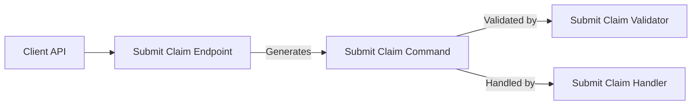

# Submit Claim Feature Documentation

## Overview

The **Submit Claim** feature enables clients to send insurance claims with one or more line items. Before processing, the system validates crucial fields—such as member and policy identifiers, line items, and amounts—to maintain data integrity. This validation step prevents invalid claims from reaching the domain logic or database.

## Architecture Overview

The following diagram illustrates where the **SubmitClaimCommandValidator** fits within the claim submission flow:



## Component Structure

### Business Layer

#### SubmitClaimCommandValidator ✔️  
(`src/Services/Claims/MedClaim.Claims.Application/Commands/SubmitClaim/SubmitClaimCommandValidator.cs`)

- **Purpose**  
  Ensures that every `SubmitClaimCommand` contains valid data before invoking the handler.

- **Responsibilities**  
  - Check that required identifiers are present.  
  - Enforce at least one line item exists.  
  - Validate each line item’s properties.

- **Dependencies**  
  - [FluentValidation](https://fluentvalidation.net/) for building validation rules.

<details><summary>Validation Rules</summary>

| Property Path         | Rule                     | Error Message                          |
|-----------------------|--------------------------|----------------------------------------|
| `MemberId`            | NotEmpty                 | MemberId is required                  |
| `PolicyId`            | NotEmpty                 | PolicyId is required                  |
| `LineItems`           | NotEmpty                 | At least one line item is required    |
| `LineItems[].ServiceCode`   | NotEmpty             | ServiceCode is required               |
| `LineItems[].ProviderName`  | NotEmpty             | ProviderName is required              |
| `LineItems[].Amount`        | GreaterThan(0)       | Amount must be greater than zero      |

</details>

> [!TIP]  
> Register `SubmitClaimCommandValidator` in the DI container so MediatR can invoke it automatically during pipeline execution.

```card
{"title":"Validation Stage","content":"This validator runs before the command handler to guarantee command data integrity."}
```

## Data Models

### SubmitClaimCommand  
Represents the request to submit a claim.

```csharp
public sealed record SubmitClaimCommand(
    Guid MemberId,
    Guid PolicyId,
    string Notes,
    IEnumerable<ClaimLineItemRequest> LineItems) : ICommand<Guid>;
```

| Property    | Type                                  | Description                                   |
|-------------|---------------------------------------|-----------------------------------------------|
| MemberId    | `Guid`                                | Identifier of the member submitting the claim |
| PolicyId    | `Guid`                                | Identifier of the associated policy           |
| Notes       | `string`                              | Optional notes provided by the client         |
| LineItems   | `IEnumerable<ClaimLineItemRequest>`   | Collection of service details for the claim   |

### ClaimLineItemRequest  
Details for each service in the claim.

```csharp
public sealed record ClaimLineItemRequest(
    string ServiceCode,
    string ProviderName,
    DateTime ServiceDate,
    decimal Amount);
```

| Property      | Type      | Description                         |
|---------------|-----------|-------------------------------------|
| ServiceCode   | `string`  | Code representing the service       |
| ProviderName  | `string`  | Name of the service provider        |
| ServiceDate   | `DateTime`| Date when the service was rendered  |
| Amount        | `decimal` | Charge amount for the service       |

## Error Handling

- When validation fails, **FluentValidation** throws a `ValidationException` containing all broken rules.  
- Errors propagate back to the API layer, resulting in a **400 Bad Request** with detailed messages.

## Dependencies

- **FluentValidation**  
- **MediatR** (for command pipeline)  
- .NET 6+ (assumed)

## Testing Considerations

Key scenarios to cover in unit tests for `SubmitClaimCommandValidator`:

- Missing `MemberId`  
- Missing `PolicyId`  
- Empty `LineItems` collection  
- Line item with empty `ServiceCode`  
- Line item with empty `ProviderName`  
- Line item with non-positive `Amount`  

## Key Classes Reference

| Class                         | Location                                                                                                 | Responsibility                                    |
|-------------------------------|----------------------------------------------------------------------------------------------------------|---------------------------------------------------|
| SubmitClaimCommandValidator   | `.../Commands/SubmitClaim/SubmitClaimCommandValidator.cs`                                                | Validate inputs of `SubmitClaimCommand`           |
| SubmitClaimCommand            | `.../Commands/SubmitClaim/SubmitClaimCommand.cs`                                                         | Encapsulate data for submitting a claim           |
| ClaimLineItemRequest          | `.../Commands/SubmitClaim/SubmitClaimCommand.cs`                                                         | Represent individual line items in the command    |
| SubmitClaimCommandHandler     | `.../Commands/SubmitClaim/SubmitClaimCommandHandler.cs`                                                  | Handle validated `SubmitClaimCommand` and persist |