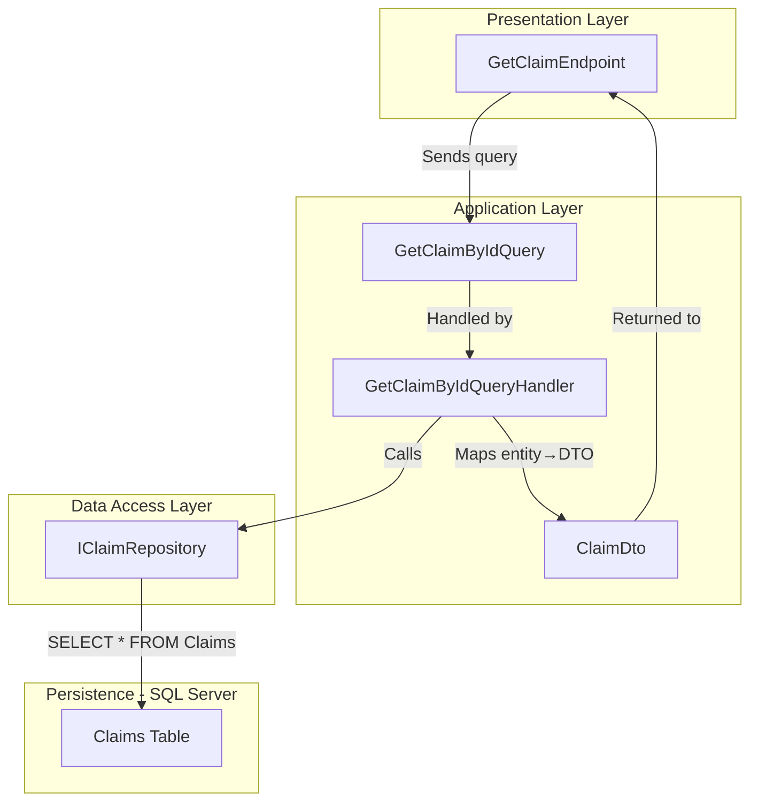
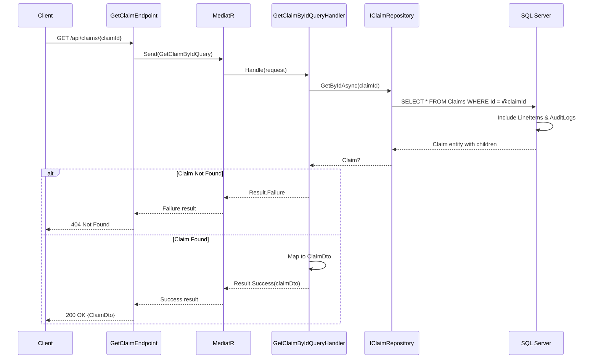

# GetClaimById Query Feature Documentation

## Overview

The **GetClaimById** query encapsulates the criteria for retrieving a single claim by its unique identifier. It aligns with the CQRS pattern, decoupling the request definition from its handling logic. When dispatched via MediatR, this query ensures a clear contract between API layers and application services, improving maintainability and testability.

Upon handling, the application layer locates the claim in the data store and returns a rich `ClaimDto` object. This DTO carries all necessary information—including line-item details—back to the caller, enabling consistent consumption by presentation or integration layers.

## Architecture Overview



## Component Structure

### 1. Business Layer

#### **GetClaimByIdQuery** (`src/Services/Claims/MedClaim.Claims.Application/Queries/GetClaimById/GetClaimByIdQuery.cs`)

- **Purpose**  
  Encapsulates the parameter needed to fetch a specific claim by its `Guid`.

- **Implements**  
  `IQuery<ClaimDto>` 

- **Key Property**  
  - `ClaimId` (`Guid`): Identifier of the claim to retrieve.

<details><summary>Record Definition</summary>

```csharp
public sealed record GetClaimByIdQuery(Guid ClaimId) : IQuery<ClaimDto>;
```
</details>

#### **GetClaimByIdQueryHandler** (`src/Services/Claims/MedClaim.Claims.Application/Queries/GetClaimById/GetClaimByIdQueryHandler.cs`)

- **Responsibility**  
  Handles `GetClaimByIdQuery`, interacts with the repository, and maps the domain entity to `ClaimDto`. 

- **Key Steps**  
  1. Invokes `IClaimRepository.GetByIdAsync` with `request.ClaimId`.  
  2. Returns a failure result if not found.  
  3. Constructs `ClaimDto` (including line items).  
  4. Returns a success result wrapping the DTO.

### 2. Data Models

#### **ClaimDto** (`src/Services/Claims/MedClaim.Claims.Application/Common/ClaimDto.cs`)

Represents a claim’s data in a transport-friendly format. 

| Property     | Type                                    | Description                             |
|--------------|-----------------------------------------|-----------------------------------------|
| Id           | `Guid`                                  | Unique identifier of the claim.         |
| MemberId     | `Guid`                                  | Identifier of the member who claimed.   |
| PolicyId     | `Guid`                                  | Associated policy identifier.           |
| Status       | `ClaimStatus`                           | Current status of the claim.            |
| Notes        | `string`                                | Additional claimant notes.              |
| TotalAmount  | `decimal`                               | Sum of all line-item amounts.           |
| SubmittedAt  | `DateTime`                              | Timestamp of claim submission.          |
| LineItems    | `IEnumerable<ClaimLineItemDto>`         | Detailed list of claim line items.      |

#### **ClaimLineItemDto** (`src/Services/Claims/MedClaim.Claims.Application/Common/ClaimDto.cs`)

| Property      | Type       | Description                           |
|---------------|------------|---------------------------------------|
| Id            | `Guid`     | Unique line-item identifier.          |
| ServiceCode   | `string`   | Code of the service rendered.         |
| ProviderName  | `string`   | Name of the service provider.         |
| ServiceDate   | `DateTime` | Date when service occurred.           |
| Amount        | `decimal`  | Cost of the individual service.       |

## Feature Flow

### Retrieval Sequence

The following sequence diagram illustrates how a `GetClaimByIdQuery` traverses the system to return a `ClaimDto`. 



## Integration Points

- **`IQuery<T>`**  
  Marker interface that integrates with MediatR to dispatch queries.  
- **`GetClaimByIdQueryHandler`**  
  Orchestrates repository calls and DTO mapping.  
- **`IClaimRepository`**  
  Abstracts data-access operations against the claims store.  
- **`ClaimDto`**  
  Final output model returned to calling layers.

## Key Classes Reference

| Class                   | Location                                                                                  | Responsibility                                            |
|-------------------------|-------------------------------------------------------------------------------------------|-----------------------------------------------------------|
| **GetClaimByIdQuery**       | `.../GetClaimByIdQuery.cs`                                                                | Defines the input for retrieving a single claim.          |
| **IQuery<TResponse>**       | `.../Abstractions/IQueryHandler.cs`                                                       | Marker interface for query requests returning `Result<T>`. |
| **ClaimDto**                | `.../Common/ClaimDto.cs`                                                                  | DTO carrying claim and line-item data.                    |
| **ClaimLineItemDto**        | `.../Common/ClaimDto.cs`                                                                  | DTO for individual claim line-item details.               |
| **GetClaimByIdQueryHandler**| `.../GetClaimByIdQueryHandler.cs`                                                         | Implements the handling logic for the query.              |

## Dependencies

- **MediatR**  
  Coordinates query dispatch and handler resolution.  
- **MedClaim.Shared.Primitives**  
  Provides the `Result<T>` type for standardized success/failure responses.  
- **IClaimRepository**  
  Injected dependency for fetching domain entities from persistence.  

## Testing Considerations

- **Positive Scenario**  
  - Dispatch `GetClaimByIdQuery` with an existing `ClaimId`.  
  - Assert `Result.IsSuccess` is `true`.  
  - Verify returned `ClaimDto` matches expected entity state.

- **Negative Scenario**  
  - Dispatch with a non-existent `ClaimId`.  
  - Assert `Result.IsFailure` is `true`.  
  - Check error message contains the missing ID.