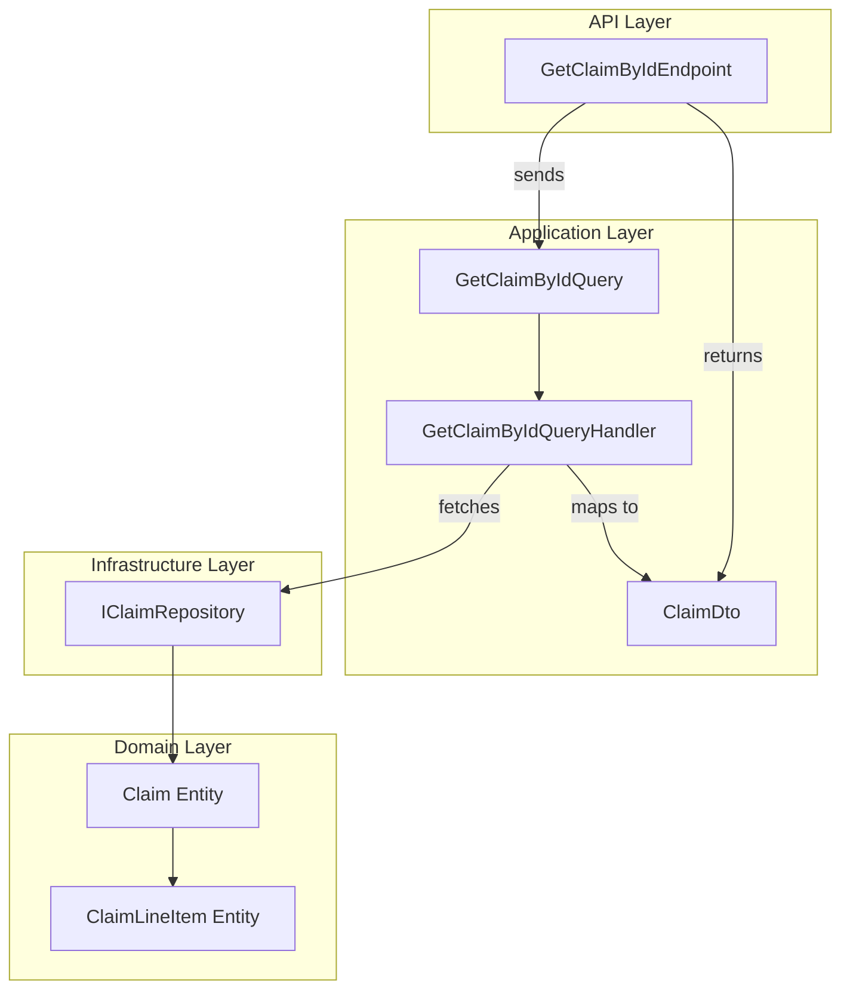
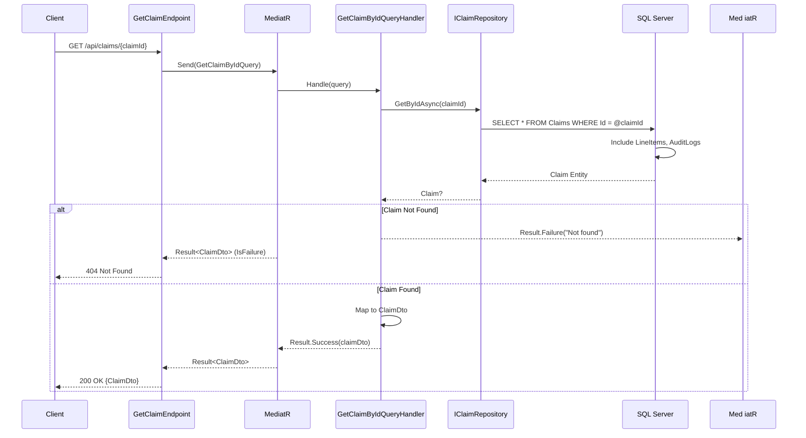

# Get Claim By Id Feature Documentation

## Overview

Retrieves a single claim’s details by its unique identifier. The handler fetches the claim aggregate from persistence, maps it to a transport-friendly DTO, and wraps it in a result type indicating success or failure. This ensures consumers receive a consistent response shape and clear error handling.

In the broader application, this query supports any API endpoint or UI component that needs to display full claim information—including metadata and line items—without exposing domain entities directly.

## Architecture Overview



## Component Structure

### 1. Application Layer

#### **GetClaimByIdQuery** (`src/Services/Claims/MedClaim.Claims.Application/Queries/GetClaimById/GetClaimByIdQuery.cs`)

- Encapsulates the request to retrieve a claim.
- **Key Property:**
  - `ClaimId` (`Guid`) — Identifier of the claim to fetch 

```csharp
public sealed record GetClaimByIdQuery(Guid ClaimId) : IQuery<ClaimDto>;
```

#### **GetClaimByIdQueryHandler** (`src/Services/Claims/MedClaim.Claims.Application/Queries/GetClaimById/GetClaimByIdQueryHandler.cs`)

- Handles `GetClaimByIdQuery` via MediatR.
- Injects `IClaimRepository` to load the domain entity.
- Maps the entity to a `ClaimDto` or returns a failure result when not found.

| Method | Description | Returns |
|--------|-------------|---------|
| `Handle(GetClaimByIdQuery request, CancellationToken cancellationToken)` | Loads the claim, checks existence, and maps to DTO | `Task<Result<ClaimDto>>`  |

```csharp
public async Task<Result<ClaimDto>> Handle(GetClaimByIdQuery request, CancellationToken cancellationToken)
{
    var claim = await _claimRepository.GetByIdAsync(request.ClaimId, cancellationToken);
    if (claim is null)
        return Result.Failure<ClaimDto>($"Claim with ID {request.ClaimId} not found");

    var claimDto = new ClaimDto(
        claim.Id,
        claim.MemberId,
        claim.PolicyId,
        claim.Status,
        claim.Notes,
        claim.TotalAmount,
        claim.SubmittedAt,
        claim.LineItems.Select(l => new ClaimLineItemDto(
            l.Id, l.ServiceCode, l.ProviderName, l.ServiceDate, l.Amount)));

    return Result.Success(claimDto);
}
```

> [!NOTE]
> The handler uses a **Result** wrapper to standardize success and error flows.

### 2. Data Access Layer

#### **IClaimRepository** (`src/Services/Claims/MedClaim.Claims.Application/Abstractions/IClaimRepository.cs`)

Abstracts persistence operations for the `Claim` aggregate.

| Method                          | Description                                                           | Returns                     |
|---------------------------------|-----------------------------------------------------------------------|-----------------------------|
| `GetByIdAsync(Guid id, CancellationToken)`       | Fetches a claim by its ID, including line items and audit logs       | `Task<Claim?>`  |
| `GetByMemberIdAsync(Guid memberId, CancellationToken)` | Retrieves all claims for a specific member, ordered by submission time | `Task<IEnumerable<Claim>>`  |
| `AddAsync(Claim claim, CancellationToken)`        | Adds a new claim to the data store                                    | `Task`                      |
| `UpdateAsync(Claim claim, CancellationToken)`     | Persists updates to an existing claim                                 | `Task`                      |

### 3. Data Models

#### **ClaimDto** (`src/Services/Claims/MedClaim.Claims.Application/Common/ClaimDto.cs`)

| Property      | Type                            | Description                             |
|---------------|---------------------------------|-----------------------------------------|
| `Id`          | `Guid`                          | Unique identifier of the claim          |
| `MemberId`    | `Guid`                          | Member who submitted the claim          |
| `PolicyId`    | `Guid`                          | Associated policy identifier            |
| `Status`      | `ClaimStatus`                   | Current claim status enumeration        |
| `Notes`       | `string`                        | Additional notes provided               |
| `TotalAmount` | `decimal`                       | Sum of all line-item amounts            |
| `SubmittedAt` | `DateTime`                      | UTC timestamp of submission             |
| `LineItems`   | `IEnumerable<ClaimLineItemDto>` | Collection of claim line items          |

#### **ClaimLineItemDto**

| Property      | Type       | Description               |
|---------------|------------|---------------------------|
| `Id`          | `Guid`     | Unique identifier         |
| `ServiceCode` | `string`   | Service code provided     |
| `ProviderName`| `string`   | Name of the provider      |
| `ServiceDate` | `DateTime` | Date the service occurred |
| `Amount`      | `decimal`  | Cost of the service       |


## Feature Flows

### Claim Retrieval Flow




## Key Classes Reference

| Class                     | Location                                                                                         | Responsibility                                        |
|---------------------------|--------------------------------------------------------------------------------------------------|-------------------------------------------------------|
| `GetClaimByIdQuery`       | `.../Queries/GetClaimById/GetClaimByIdQuery.cs`                                                  | Represents the request payload for claim retrieval    |
| `GetClaimByIdQueryHandler`| `.../Queries/GetClaimById/GetClaimByIdQueryHandler.cs`                                           | Orchestrates fetch and mapping of claim to DTO        |
| `IClaimRepository`        | `.../Abstractions/IClaimRepository.cs`                                                           | Defines persistence operations for the Claim aggregate|
| `ClaimDto`                | `.../Common/ClaimDto.cs`                                                                         | Data transfer object modeling a claim and its items   |
| `ClaimLineItemDto`        | `.../Common/ClaimDto.cs`                                                                         | DTO for individual claim line items                   |

## Error Handling

- Returns `Result.Failure<ClaimDto>` with a descriptive message when the claim is not found.
- Encapsulates errors in the `Result` type rather than throwing exceptions.

## Testing Considerations

- Validate that a known claim ID returns a populated `ClaimDto`.
- Confirm that an unknown ID yields a failure result and triggers a 404 response at the API layer.
- Verify correct mapping of all line-item properties into `ClaimLineItemDto`.

```card
{
  "title": "Not Found Handling",
  "content": "The handler returns a failure result if no claim matches the provided ID."
}
```

## Dependencies

- **MediatR** for dispatching queries and notifications.
- **MedClaim.Shared.Primitives** for the `Result<T>` wrapper.
- **IClaimRepository** abstraction to decouple from EF Core implementation.